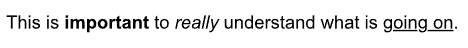
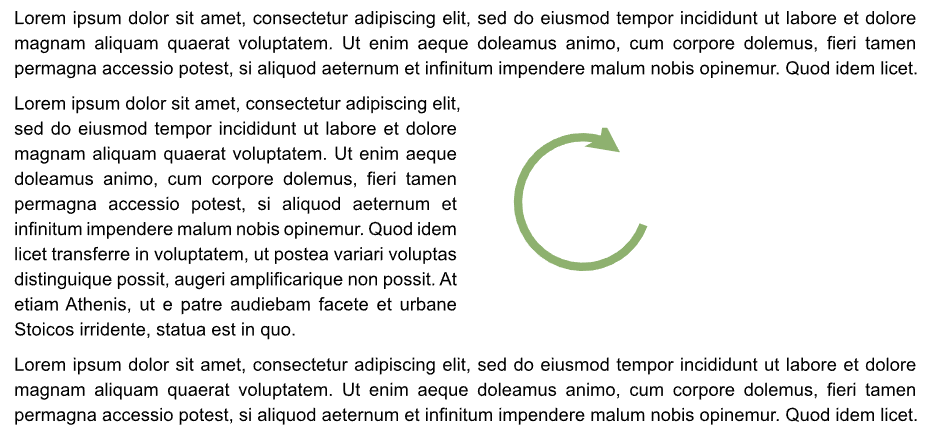
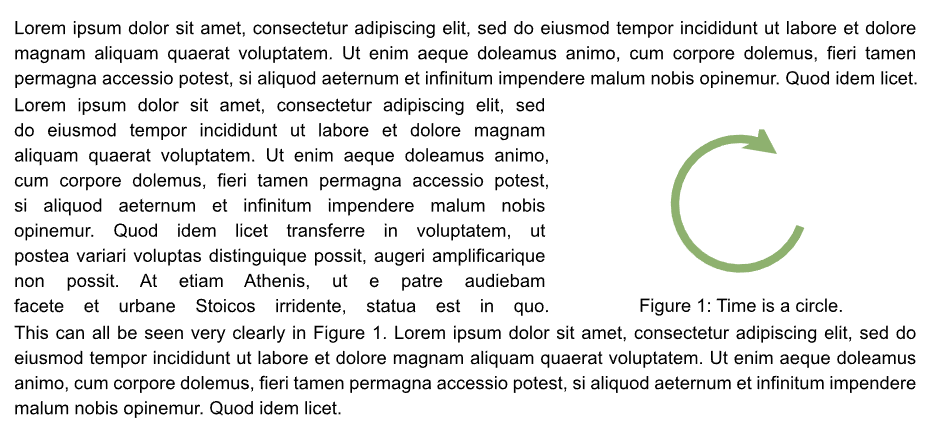
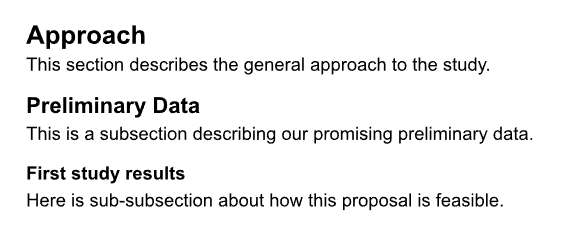
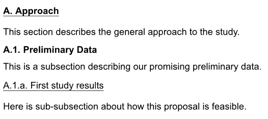
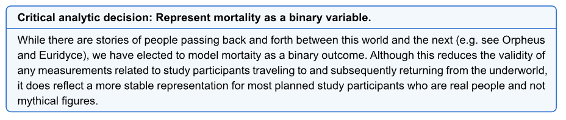
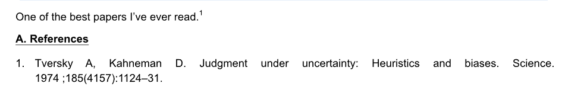
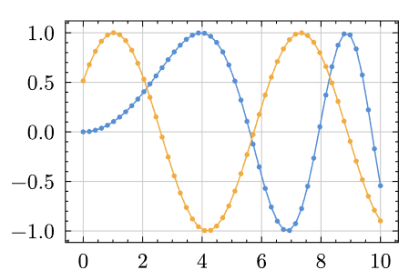
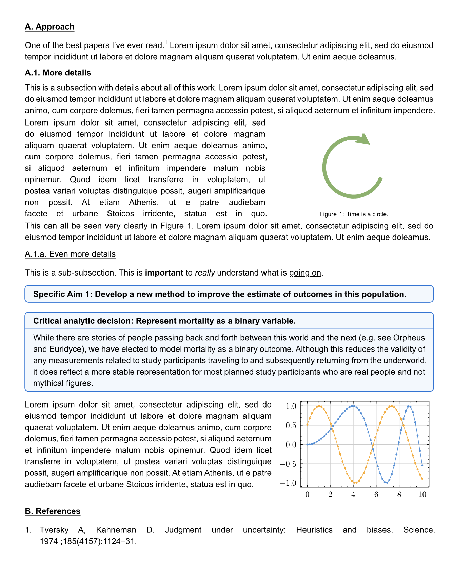

There comes a time when you have to sit down and write a grant. You want to stay focused on the science and the strategy without distractions from your corporate word processor. And you may want an unhealthy amount of control over the typesetting and formatting of the document. If this sounds like you, you are in luck! You may have tried [markdown](https://www.markdownguide.org/) and [quarto](https://quarto.org/), appreciated their speed and clean look, but found the control over formatting necessary for a grant to be insufficient. So you may have tried [LaTeX](https://www.latex-project.org/) with incredible formatting control and beautiful output, but spent too many hours of your life debugging a missing curly brace or waiting for documents to build. The good news is, now there is [Typst](https://typst.app)!

Typst is an open-source project that provides the best solution I've ever seen to write documents quickly, cleanly, and produce beautifully typeset output. The Typst project comes with [extensive documentation](https://typst.app/docs/), including some detailed [guides](https://typst.app/docs/guides/) for LaTeX users and building accessible documents. I've been using Typst for more than a year now for all of my grant proposals and manuscripts. And I love it. 

For example, many of the quick formatting options are similar to markdown for bold and italics, while underlining is very simple. You could write: `This is *important* to _really_ understand what is #underline[going on].` And get the output:



In this blog post, I'll explain how I tweaked the formatting settings to comply with NIH criteria and build a creative and fun workflow for grant writing. At the bottom, I've linked a [document template](repository](https://github.com/weissman-lab/typst_grant_template) that includes all of the code in one place to get you started.

# Setup

I work on a Mac, so install is easy via [brew](https://formulae.brew.sh/formula/typst). Or see the [Typst documentation](https://typst.app/open-source/) for installation options across a range of platforms.

You can work with whatever interactive development environment suits your style. For quick edits, I like to work in my favorite lightweight text editor while Typst automatically watches the document and renders to PDF automatically with any changes. Once you've created a file, simply open your bash terminal and use

```{bash}
typst watch my_grant.typ
```

Or if you just want to compile once, use

```{bash}
typst compile my_grant.typ
```

The documents render in milliseconds and the error messages are usually informative and clear.

For more complex documents, I like to use the outstanding [Tinymist Typst plugin for VS Code](https://github.com/Myriad-Dreamin/tinymist) that provides a wide array of features to make writing, debugging, citations, and editing a breeze. The Typst organization also offers a [web-based editing environment](https://typst.app/pricing/) similar to Overleaf with free and paid tiers.

# NIH grant formatting

The specific formatting requirements for your grant will vary by the [funding mechanism](https://grants.nih.gov/grants-process/write-application/how-to-apply-application-guide/page-limits). So be sure to review your notice of funding opportunity (NOFO) and associated documents in detail. Here are some standard NIH formatting requirements and how they can be implemented in Typst.

## Page, margins, font, and spacing

The page itself is 8.5" x 11" and margins are usually allowed down to 0.5".

```{typst}
#set page(width: 8.5in, height: 11in, margin: 0.5in)
```

The text is often 11pt using a standard font like Arial. I like to turn hyphenation off and justification on because I think it looks nicer.

```{typst}
#set text(font: "Arial", size: 11pt, hyphenate: false)
#set par(justify: true)
```

## Figure wrapping

One of the most important parts of writing a grant is inserting tables and figures at just the right size and location. This also requires wrapping text around the exhibit to maintain clarity while also maximizing your use of space on the page. When I used to write grants in LaTeX, I used the `wrapfig` package which worked very well. Typst has a library that works similarly called [`wrap-it`](https://typst.app/universe/package/wrap-it/).

I like a little more control over the details of the formatting, so I'll show here another approach that requires some more manual adjustment but provides full formatting control.

```{typst}
// some sample text
#lorem(46)

// create a grid where the text and image will go side-by-side
#grid(columns : (1fr, 1fr), // the relative "fr"action of the page width for each column
  gutter: 10pt, // how much space between the columns of the grid
  [#lorem(75)], // content of the left grid element
  [#image("exhibits/conceptual_model.svg")] // content of the right grid element
)

// more text after the wrapped area
#lorem(46)
```

Note that Typst nicely handles several image formats, including pdf, svg, png, and many others. Here's the first draft:



Now let's enhance this a bit by

- reducing extra space above and below the grid by inserting negative vertical space with `#v()`
- making the text justified more nicely in the grid by adding a custom justified line break with `#jlb`
- adjusting the column width of the conceptual model by changing the relative `fr`action
- adding a caption to the image and adjust the space (`gap`) between the figure and caption
- creating a label `<fig-conceptual-model` for the image so we can reference it `@fig-conceptual-model` directly in the text

```{typst}
// Custom justified line break for column text
#let jlb = linebreak(justify: true)

// some sample text
#lorem(46)
#v(-5pt) // get rid of extra white space
// create a grid where the text and image will go side-by-side
#grid(columns : (1.5fr, 1fr), // the relative "fr"action of the page width for each column
  gutter: 10pt, // how much space between the columns of the grid
  [#lorem(75) #jlb], // content of the left grid element
  [#figure(image("exhibits/conceptual_model.pdf"), 
    gap: -10pt, caption: [Time is a circle.]
   ) <fig-conceptual-model>
  ] // content of the right grid element
  )
#v(-5pt) // get rid of extra white space
// more text after the wrapped area
This can all be seen very clearly in @fig-conceptual-model. #lorem(46)
```



## Section headers

An important part of writing a grant is designation sections. You could do this using the built-in header formats:

```{typst}
= Approach

This section describes the general approach to the study.

== Preliminary Data

This is a subsection describing our promising preliminary data.

=== First study results

Here is sub-subsection about how this proposal is feasible.
```

Here's the output using the default formatting.



And now let's spruce these up a bit with some customizations.

```{typst}
// Set up headings
#set heading(numbering: "A.1.a.") 
#show heading: set text(size: 12pt)
#show heading.where(level: 1): it => {
  box(
  stroke: (bottom: 0.5pt),
  inset: (bottom: 0.2em),
)[#text(size: 11pt, weight: "bold", it)]
}

#show heading.where(level: 2): it => {
 text(size: 11pt, weight: "bold", it)
 v(5pt)
}

#show heading.where(level: 3): it => {
  box(
  stroke: (bottom: 0.5pt),
  inset: (bottom: 0.2em),
)[#text(size: 11pt, weight: "medium", it)]
}

= Approach

This section describes the general approach to the study.

== Preliminary Data

This is a subsection describing our promising preliminary data.

=== First study results

Here is sub-subsection about how this proposal is feasible.
```



## Call-out boxes

Another feature I like to use in grant writing is a call-out box. This might be used to highlight a new section for a specific aim, underscore a particular innovation, or draw attention to an important scientific choice that you anticipate a reviewer will want to know more about.

There are a few nice libraries in Typst to do this with minimal overhead. I will use [showybox](https://typst.app/universe/package/showybox/) here though there are others in the [Typst package universe](https://typst.app/universe/).

```{typst}
#import "@preview/showybox:2.0.4": showybox // for pop-up boxes

#showybox(frame: (
    border-color: blue,
    title-color: blue.lighten(30%),
    body-color: blue.lighten(95%),
    footer-color: blue.lighten(80%)
  ),[
  *Specific Aim 1: Develop a new method to improve the estimate of outcomes in this population.*
])
```

This creates a nice divider to highlight the beginning of a new section describing an aim.


Or use the same approach to call the reviewer's attention to a methodologic choice in your proposal.

```{typst}
#showybox(frame: (
    border-color: blue,
    title-color: blue.lighten(30%),
    body-color: blue.lighten(95%),
    footer-color: blue.lighten(80%)
  ),[
  *Critical analytic decision: Represent mortality as a binary variable.*
], 
[While there are stories of people passing back and forth between this world and the next (e.g. see Orpheus and Euridyce), we have elected to model mortaity as a binary outcome. Although this reduces the validity of any measurements related to study participants traveling to and subsequently returning from the underworld, it does reflect a more stable representation for most planned study participants who are real people and not mythical figures.] 
)
```



## References

Typst provides seamless integration wtih your current `.bib` file. I use Zotero as a reference manager then drag references into project-specific bib files. The VS Code plugin mentioned above reads those bib files to provide autocompletion while typing. Typst does also provide a custom reference format ([Hayagriva](https://typst.app/docs/reference/model/bibliography/)) that works with `.yaml` files and was developed specifically for Typst, though I have found it easier to stick with my current bibtex-based workflow. Here's an example.

Let's say you have your references saved in the file `grant_references.bib` which looks like:

```
@article{tversky1974judgment,
  title={Judgment under uncertainty: Heuristics and biases},
  author={Tversky, Amos and Kahneman, Daniel},
  journal={Science},
  volume={185},
  number={4157},
  pages={1124--1131},
  year={1974},
  publisher={American Association for the Advancement of Science}
}

```

You can cite this in the text using the `@` symbol and creating a bibliography. Typst has many [built-in bibliography formats](https://typst.app/docs/reference/model/bibliography/) though you can customize your own with a `.csl` file as needed.

```{typst}

One of the best papers I've ever read.@tversky1974judgment

= References

#bibliography("grant_references.bib", title : none, style: "vancouver-superscript")  

```

This produces:



One thing to note is that the in-line citation in the resultant PDF file will include a hyperlink to the reference in the bibliography section. While this can be helpful for reading, it's not permitted in NIH PDF files. And I haven't found a way to turn this off during the compilation process. The easiest fix is to print the resultant PDF to another PDF file which eliminates the internal hyperlinks prior to submitting to NIH.

## Miscellaneous formatting

Here are a few extra formatting tips and tricks I learned along the way.

Sometimes, if a paragraph leaves only a line or two at the bottom or top of a page, Typst will move the entire paragraph up or down to keep those lines from hanging. This results in extra whitespace that is not used and is obviously a bad use of real estate in a proposal even if it does look a little nice from a typesetting standpoint. The solution to this, not very nicely named, is to minimize widows and orphans.

```{typst}
// Stop incomplete paragraphs from breaking to next page
#set text(costs: (widow: 0%, orphan: 0%))
```

Another nice feature of Typst is the ability to insert code from other documents. This is helpful if you want to keep sections of your grant in separate files for cleaner organization and then stitch them together into a full document. Similar to LaTeX's `\include{}`, Typst provides `#include("extras/myfile.typ")` to accomplish the same.

I can't explain why, but sometimes a superscript will randomly appear in bold. To fix this, I include this at the top of the document and it seems to fix the problem:

```{typst}
// Sometimes superscripts randomly appear bold, so do this:
// https://github.com/typst/typst/issues/4006
#set super(typographic: false)
```

Typst has so many other packages the Universe that are worth exploring and may be helpful for your work. Here's one I found recently called `lilaq` that makes [very nice data visualizations](https://typst.app/universe/package/lilaq/). For example, from some sample code on the lilaq website, you can write:

```{typst}
#import "@preview/lilaq:0.6.0" as lq

#let x = lq.linspace(0, 10)
#let y = x.map(x => calc.sin(0.1 * x * x))

#lq.diagram(
  lq.plot(x, y),
  lq.plot(x, x => calc.sin(x + 0.541))
)

```

Which will produce:



# Putting it all together

Combining all of this into a single document looks like:

```{typst}
#import "@preview/showybox:2.0.4": showybox // for pop-up boxes
#import "@preview/lilaq:0.6.0" as lq

#set page(width: 8.5in, height: 11in, margin: 0.5in)
#set text(font: "Arial", size: 11pt, hyphenate: false)
#set par(justify: true)

// Stop incomplete paragraphs from breaking to next page
#set text(costs: (widow: 0%, orphan: 0%))

// Sometimes superscripts randomly appear bold, so do this:
// https://github.com/typst/typst/issues/4006
#set super(typographic: false)

// Make captions small font and fix spacing (NIH allows 8pt font in captions)
#show figure.caption: it => [#par(leading: 0.3em)[
  #text(8pt, it.supplement)
  #text(8pt, context it.counter.display(it.numbering))#text(8pt,[:])
  #text(8pt, it.body)]
]

// Custom justified line break for column text
#let jlb = linebreak(justify: true)

// Set up headings
#set heading(numbering: "A.1.a.") 
#show heading: set text(size: 12pt)
#show heading.where(level: 1): it => {
  box(
  stroke: (bottom: 0.5pt),
  inset: (bottom: 0.2em),
)[#text(size: 11pt, weight: "bold", it)]
}

#show heading.where(level: 2): it => {
 text(size: 11pt, weight: "bold", it)
 v(5pt)
}

#show heading.where(level: 3): it => {
  box(
  stroke: (bottom: 0.5pt),
  inset: (bottom: 0.2em),
)[#text(size: 11pt, weight: "medium", it)]
}


= Approach 

One of the best papers I've ever read.@tversky1974judgment #lorem(25)

== More details

This is a subsection with details about all of this work. #lorem(40)
#v(-5pt) // get rid of extra white space
// create a grid where the text and image will go side-by-side
#grid(columns : (1.5fr, 1fr), // the relative "fr"action of the page width for each column
  gutter: 10pt, // how much space between the columns of the grid
  [#lorem(75) #jlb], // content of the left grid element
  [#figure(image("exhibits/conceptual_model.pdf"), gap: -10pt, caption: [Time is a circle.]) <fig-conceptual-model>] // content of the right grid element
  )
#v(-5pt) // get rid of extra white space
// more text after the wrapped area
This can all be seen very clearly in @fig-conceptual-model. #lorem(25)

=== Even more details

This is a sub-subsection. This is *important* to _really_ understand what is #underline[going on].

#showybox(frame: (
    border-color: blue,
    title-color: blue.lighten(30%),
    body-color: blue.lighten(95%),
    footer-color: blue.lighten(80%)
  ),[
  *Specific Aim 1: Develop a new method to improve the estimate of outcomes in this population.*
])

#showybox(frame: (
    border-color: blue,
    title-color: blue.lighten(30%),
    body-color: blue.lighten(95%),
    footer-color: blue.lighten(80%)
  ),[
  *Critical analytic decision: Represent mortality as a binary variable.*
], 
[While there are stories of people passing back and forth between this world and the next (e.g. see Orpheus and Euridyce), we have elected to model mortality as a binary outcome. Although this reduces the validity of any measurements related to study participants traveling to and subsequently returning from the underworld, it does reflect a more stable representation for most planned study participants who are real people and not mythical figures.] 
)

#grid(columns: (1.6fr, 1fr), gutter: 10pt,
[#lorem(75)],
[
  #let x = lq.linspace(0, 10)
#let y = x.map(x => calc.sin(0.1 * x * x))

#lq.diagram(
  lq.plot(x, y),
  lq.plot(x, x => calc.sin(x + 0.541))
)
]
)

= References

#bibliography("grant_references.bib", title : none, style: "vancouver-superscript")  

```

Here's what the compiled page might look like using all these tricks in one place:



And here's a simple GitHub [repository](https://github.com/weissman-lab/typst_grant_template) with the files needed to start your own grant proposal. Thanks, Typst team! And happy writing!
